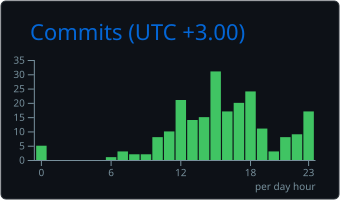
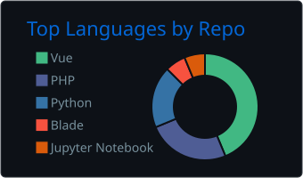
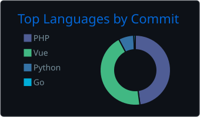
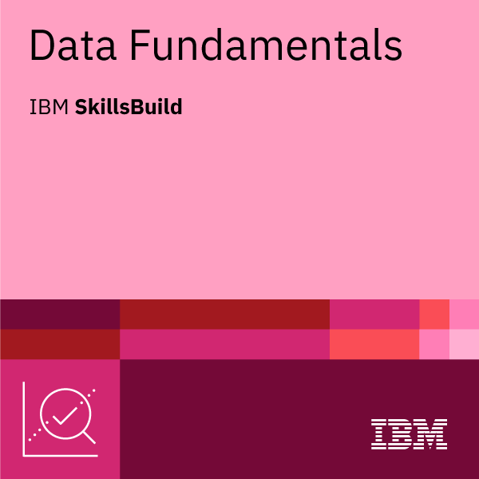
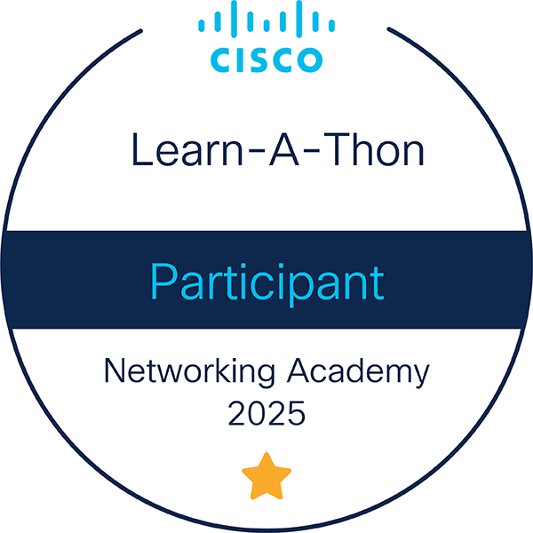

<h1 align="center"> Hi, I'm Dev bAtasi!</h1>

  

  

### Languages and Tools

  

---

### GitHub Stats & Contribution Snapshot

  
  

  

  

### Language Analytics

  
  

  
    Repository language distribution and commit-based language activity.
  

---

###  Random Dev Quote

### GitHub Trophy Cabinet

  &nbsp;&nbsp;

  &nbsp;&nbsp;

  

### Badges Cabinet

  &nbsp;&nbsp;
  

 

###  Connect with Me

